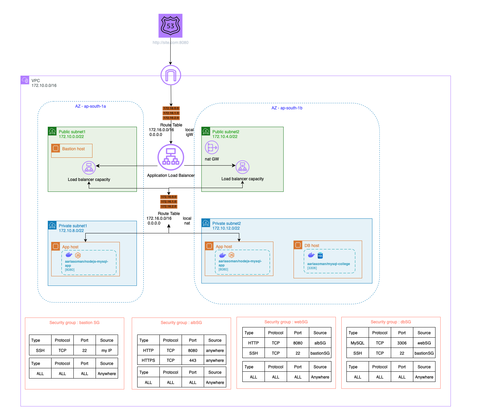

# Sample NodeJS Application with MySQL and Terraform Infrastructure Deployment

This repository demonstrates a an approach to containerizing a Node.js application and a MySQL database with preloaded data, followed by deploying the complete infrastructure on AWS using Terraform. The project showcases infrastructure-as-code practices combined with Docker containerization and CI/CD automation using GitHub Actions.

---

## Overview

The project is designed to illustrate how to:

- **Containerize** a Node.js backend service and a MySQL database, preloading the database with sample data using Docker.
- **Build and push Docker images** for both the Node.js app and MySQL database to Docker Hub.
- **Provision AWS infrastructure** (including EC2 instances, networking components, load balancers, and Route53 DNS entries) using Terraform.
- **Deploy the application infrastructure** on AWS with secure access and high availability.
- **Automate the build and deployment workflow** via GitHub Actions for continuous integration and delivery.

---
## Architecture

## Key Components and Architecture

### 1. Node.js Application

- Built on **Node.js 20-alpine** base image for lightweight containerization.
- Application environment variables are injected dynamically at build and runtime for database connectivity.
- Exposes port **8080** to serve REST endpoints.

### 2. MySQL Database

- Uses the official **MySQL latest** Docker image.
- Initializes a database named `college` with a pre-defined `students` table.
- Preloads the database with sample student records via an initialization SQL script.
- Creates a dedicated database user (`appadmin`) with appropriate privileges for the Node.js app.

### 3. Docker Containerization

- Separate Dockerfiles are created for the app and database.
- Both images are built with argument passing for credentials and configuration.
- Images are tagged and pushed to Docker Hub, facilitating consistent deployments.

### 4. Infrastructure as Code with Terraform

- Defines AWS resources including:
  - VPC subnets and security groups for isolation.
  - EC2 instances for Node.js app and database server.
  - Bastion host for secure SSH access.
  - Application Load Balancer (ALB) with HTTP to HTTPS redirection.
  - Target groups and health checks for load balancer routing.
  - Route53 DNS records for application and database endpoints.
- Automates deployment with **user_data** scripts for instance initialization.

### 5. CI/CD Automation with GitHub Actions

- **image_build.yml** workflow:
  - Builds Docker images for the database and Node.js app.
  - Pushes images securely to Docker Hub using GitHub Secrets.
- **deploy_infra.yml** workflow:
  - Runs Terraform commands (`init`, `fmt`, `validate`, `plan`, `apply`) to provision AWS infrastructure.
  - Uses AWS credentials stored securely in GitHub Secrets.

---

## Workflow and Usage

1. **Build Docker Images:**
   - Trigger the `image_build.yml` workflow manually or via webhook.
   - Images are built with necessary environment variables and pushed to Docker Hub.

2. **Deploy Infrastructure:**
   - Trigger the `deploy_infra.yml` workflow manually.
   - Terraform provisions the AWS resources, deploying the containers and configuring the environment.

3. **Access the Application:**
   - Use the Route53 DNS name configured in Terraform to access the Node.js application behind the load balancer.
   - The app connects to the preloaded MySQL database hosted on a private EC2 instance.
---

## Prerequisites

- AWS account with necessary permissions.
- Docker Hub account for image repository.
- GitHub repository with secrets configured for Docker Hub credentials, AWS keys, and database passwords.
- Terraform installed locally or leveraged via CI pipelines.

